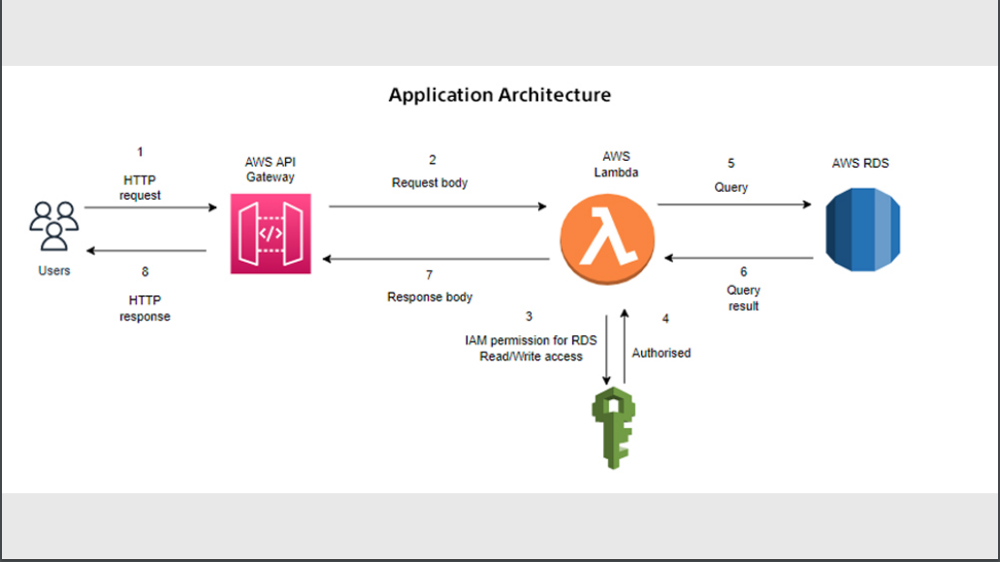
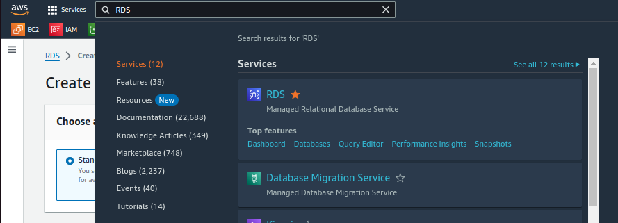
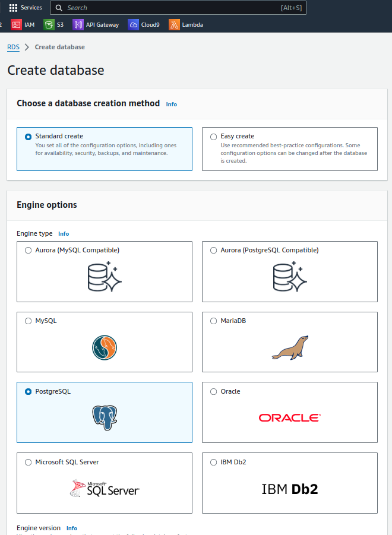
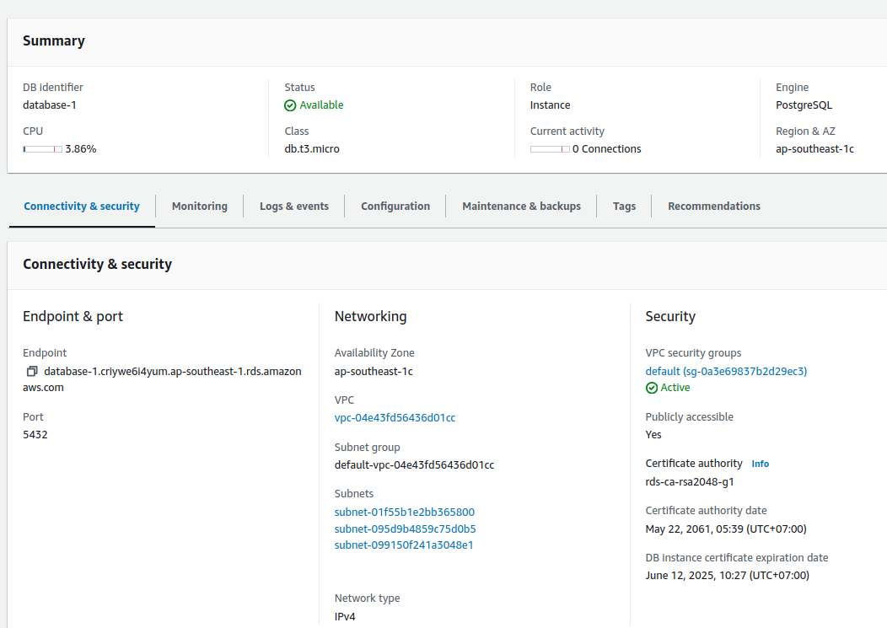
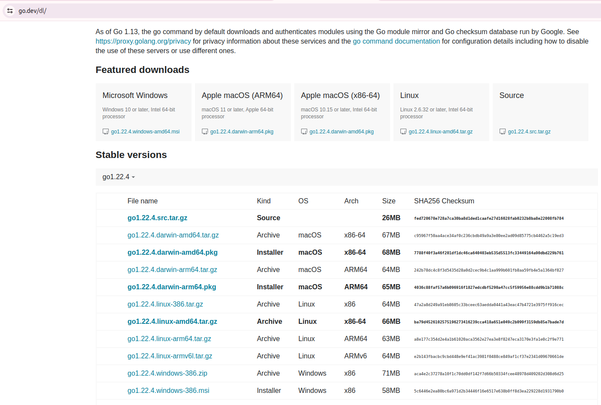
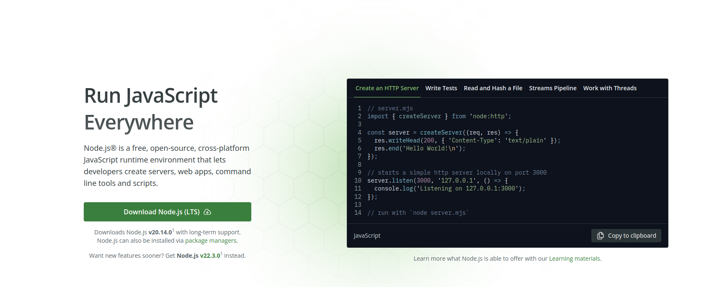

# Giới thiệu
Trong bối cảnh công nghệ thông tin ngày càng phát triển, việc xây dựng các ứng dụng có khả năng mở rộng và linh hoạt là rất cần thiết. Khóa học này sẽ giúp bạn hiểu sâu hơn về việc triển khai các dịch vụ không máy chủ (serverless) trên nền tảng AWS, sử dụng RDS PostgreSQL làm cơ sở dữ liệu, và kiểm soát tải với API Gateway.

## Thông Tin Khóa Học
Chúng tôi sẽ bắt đầu bằng việc thiết lập một mô hình CRUD (Create, Read, Update, Delete) serverless cho ứng dụng của bạn, sử dụng RDS PostgreSQL. Bạn sẽ được hướng dẫn cách xây dựng và quản lý bốn API sau để tương tác với cơ sở dữ liệu:

- **Tạo Người Dùng Mới (Create User)**
- **Cập Nhật Thông Tin Người Dùng (Update User)**
- **Xóa Người Dùng Theo Tên Người Dùng (Delete User)**
- **Lấy Danh Sách Người Dùng Theo Tên (Get User List)**

## Mô hình triển khai


## Setup môi trường 
### 1. Tạo RDS Postgres trên aws 
Truy cập vào AWS Console, tìm kiếm RDS. 



Tại đây tiến hành chọn **create database**



Sau khi database khởi tạo hoàn tất , chúng ta có thể lấy endpoint để kết nối như hình bên dưới.




### 2. Connect db và tạo table user
Tạo Bảng User
Đầu tiên, chúng ta cần tạo một bảng `users` để lưu trữ thông tin. Dưới đây là câu lệnh SQL để tạo bảng:

```sql
CREATE TABLE "users" (
    "id" bigserial,
    username character varying(50) COLLATE pg_catalog."default",
    name character varying(50) COLLATE pg_catalog."default" NOT NULL,
    phone character varying(50) COLLATE pg_catalog."default",
    PRIMARY KEY ("id")
);
```

### 2. Install go 
Truy cập link bên dưới, sau đó chọn go cho hệ điều hành tương ứng và tiến hành cài đặt.

https://go.dev/dl/



### 3. Install nodejs 

Truy cập link bên dưới để tiến hành cài nodejs 

https://nodejs.org/en



### 4. Install serverless 

Sau khi cài đặt nodejs thành công, tiến hành install serverless 

```cmd
npm i serverless -g
```

### 5. Clone source 

Chạy lệnh bên dưới để pull source code: 

```git
git clone https://github.com/mentor-online/aws-serverless-crud-postgres.git
```


### 6. Build và deploy 

Sử dụng vscode mở terminal lên và thực thi lệnh sau để tiến hành build source code và deploy lên aws: 

```cmd 
make deploy 
```

### 7. Remove resource

Thực thi lệnh bên dưới để tiến hành remove source khi không sử dụng:
```cmd 
sls remove 
```


### Cấu Trúc API
Mỗi API sẽ có đầu vào là thông tin của người dùng và đầu ra là kết quả của quá trình xử lý. Đặc biệt, bạn cần kiểm tra tính duy nhất của `username` khi tạo mới, không sử dụng ràng buộc unique của cơ sở dữ liệu.

### API Insert
- create user với username, name, phone. Phải check username tồn tại duy nhất trong table, không sử dụng unique của database
- input:
```go
{
    "requestId": {{uuid}},
    "requestTime": {{timeRPC3339}},
    "data": {
        "username": {{string}},
        "name": {{string}},
        "phone": {{string}}
    }
}
```
- output:
```go
{
    "responseId": {{requestId}},
    "responseTime": {{timeRPC3339}},
    "responseCode": {{string}},
    "responseMessage": {{string}}
}
```

### API Update
- update user by username. Thông tin update là name và phone.
- input:
```go
{
    "requestId": {{uuid}},
    "requestTime": {{timeRPC3339}},
    "data": {
        "username": {{string}},
        "name": {{string}},
        "phone": {{string}}
    }
}
```

- output:
```go
{
    "responseId": {{requestId}},
    "responseTime": {{timeRPC3339}},
    "responseCode": {{string}},
    "responseMessage": {{string}},
}
```

### API Delete
- delete user by username
- input:
```go
{
    "requestId": {{uuid}},
    "requestTime": {{timeRPC3339}},
    "data": {
        "username": {{string}}
    }
}
```

- output:
```go
{
    "responseId": {{requestId}},
    "responseTime": {{timeRPC3339}},
    "responseCode": {{string}},
    "responseMessage": {{string}},
}
```

### API Get list
- get list by username
- input:
```go
{
    "requestId": {{uuid}},
    "requestTime": {{timeRPC3339}},
    "data": {
        "username": {{string}}
    }
}
```

- output:
```go
{
    "responseId": {{uuid}},
    "responseTime": {{timeRPC3339}},
    "responseCode": {{string}},
    "responseMessage": {{string}},
    "data": {
        "username": {{string}},
        "name": {{string}},
        "phone": {{string}}
    }
}
```

## Mời Tham Gia Khóa Học Nâng Cao
Sau khi hoàn thành khóa học này, bạn có thể tiếp tục tham gia vào khóa học chuyên sâu về **Ứng dụng Java Springboot xây dựng một hệ thống API RESTful chuẩn ngân hàng**. Hãy đăng ký ngay tại [mentoronline.edu.vn](https://mentoronline.edu.vn/subcribe-java-beanstalk-aws)  
